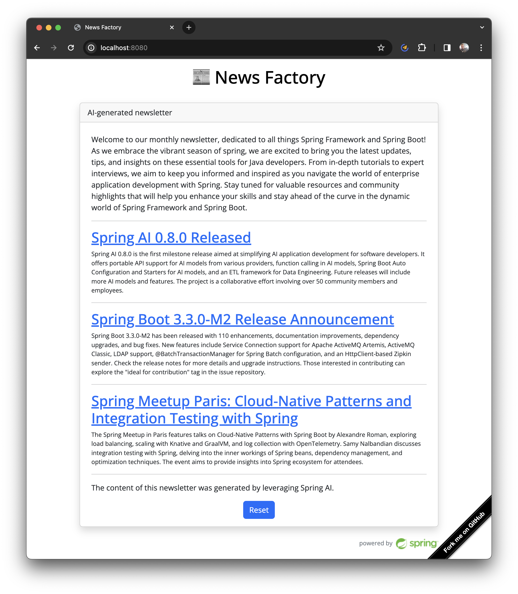

# News Factory: create AI-generated newsletters

This project relies on [OpenAI](https://openai.com/) to generate a newsletter.
Enter your favorite topics, add your own links, and let the app generates a digest
for you. Behind the scenes, webpages are downloaded, and the content is summarized
using the LLM. The app takes care of rendering the result in a single page.



This app is powered by [Spring AI](https://spring.io/projects/spring-ai),
an open-source Spring project which simplifies the use of AI technologies for your
Java project.

## How to build and run this app?

Use Java 21 to build and run this app. 

Use this command to build the app:

```shell
./mvnw clean package
```

You need an OpenAI API key to run this app.
[Refer to this page](https://help.openai.com/en/articles/4936850-where-do-i-find-my-openai-api-key)
to get an API key.

Set your API key as an environment variable:

```shell
export OPENAI_API_KEY=xxxxxx
```

Use this command to run the app on your local workstation:

```shell
./mvnw spring-boot:run
```

The app is available at http://localhost:8080:
```shell
curl -v localhost:8080
```

## Contribute

Contributions are always welcome!

Feel free to open issues & send PR.

## License

Copyright &copy; 2024 [Broadcom, Inc. or its affiliates](https://vmware.com).

This project is licensed under the [Apache Software License version 2.0](https://www.apache.org/licenses/LICENSE-2.0).
